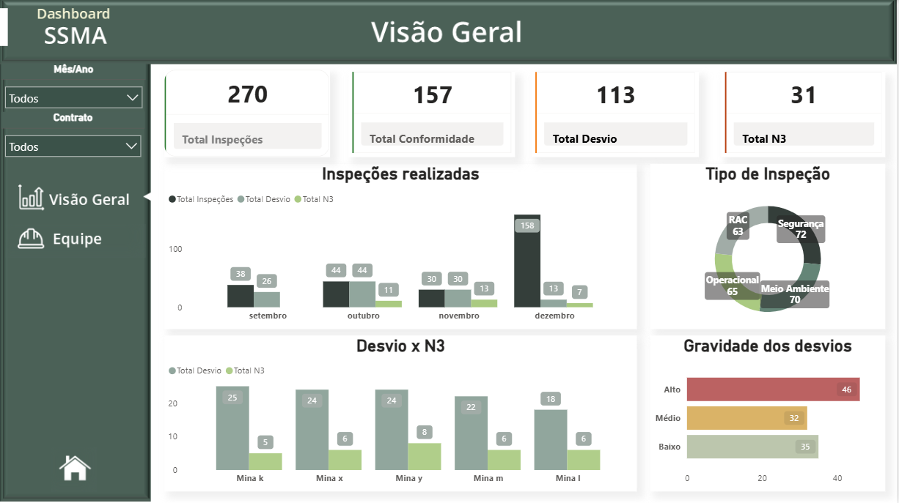

# 📊 Dashboard de Análise de Performance de SSMA

Transformando dados de segurança em cultura preventiva 📊

A gestão de Saúde, Segurança e Meio Ambiente (SSMA) gera um volume enorme de informações todos os dias. Mas dados soltos em planilhas não evitam acidentes; informação organizada gera ação.

Dashboard desenvolvido em Power BI para demonstrar como é possível centralizar indicadores críticos de segurança, facilitando a tomada de decisão rápida. 

💡 Nota: Para fins de confidencialidade, a base de dados foi totalmente alterada e apresenta apenas números fictícios, sem relação com cenários reais.

O objetivo é mostrar como a tecnologia pode ser a maior aliada da prevenção.

## ✨ Visualize e Interaja (Link Público)

O dashboard está publicado e disponível para visualização interativa no Power BI Service.

👉 **[Clique aqui para acessar o Dashboard Interativo](https://app.powerbi.com/view?r=eyJrIjoiZDk0NGRlZDQtY2ZiMy00ZjVmLTk0M2UtMGYyZGRmNmVkNjA4IiwidCI6IjE0Y2JkNWE3LWVjOTQtNDZiYS1iMzE0LWNjMGZjOTcyYTE2MSIsImMiOjh9)**

## 🚀 Preview (Screenshot)

Para uma visualização rápida do design e dos principais gráficos, confira o screenshot abaixo:

## 🛠️ Tecnologias Utilizadas

* **Ferramenta Principal:** Power BI Desktop (Modelagem de Dados, DAX, Visualização)
* **Conceitos Chave:** Criação de Medidas DAX, Relação entre Tabelas, KPI Cards.
